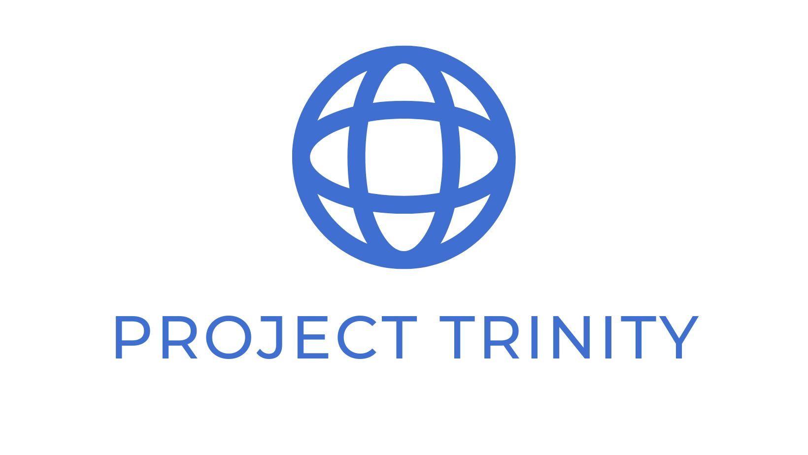

[//]: # (
)

[//]: # ()

[//]: # ()

[//]: # ()

[//]: # ()

[//]: # (
)

## 💻 About the project

The Project Trinity is a rest-api project that aims to provide services for an ERP backend, using clean architecture and
best practices. Aiming to improve and help small businesses organize their inventory, sales, accounts payable and accounts
receivable, in addition to connecting with other services such as cloud shop and tax services.

[//]: # (## 📐 Architecture)

[//]: # ()
[//]: # (Laravel has the most extensive and thorough [documentation]&#40;https://laravel.com/docs&#41; and video tutorial library of all modern web application frameworks, making it a breeze to get started with the framework.)

[//]: # ()
[//]: # (You may also try the [Laravel Bootcamp]&#40;https://bootcamp.laravel.com&#41;, where you will be guided through building a modern Laravel application from scratch.)

[//]: # ()
[//]: # (If you don't feel like reading, [Laracasts]&#40;https://laracasts.com&#41; can help. Laracasts contains over 2000 video tutorials on a range of topics including Laravel, modern PHP, unit testing, and JavaScript. Boost your skills by digging into our comprehensive video library.)

[//]: # ()
[//]: # (## Laravel Sponsors)

[//]: # ()
[//]: # (We would like to extend our thanks to the following sponsors for funding Laravel development. If you are interested in becoming a sponsor, please visit the Laravel [Patreon page]&#40;https://patreon.com/taylorotwell&#41;.)

## 🛠️ Technologies and tools

- **[PHP](https://www.php.net/releases/8.1/en.php)**
- **[Laravel](https://laravel.com/)**
- **[PHP Code Sniffer](https://github.com/squizlabs/PHP_CodeSniffer)**
- **[Swagger-PHP](https://github.com/zircote/swagger-php)**

[//]: # ()
[//]: # (## License)

[//]: # ()
[//]: # (The Laravel framework is open-sourced software licensed under the [MIT license]&#40;https://opensource.org/licenses/MIT&#41;.)
